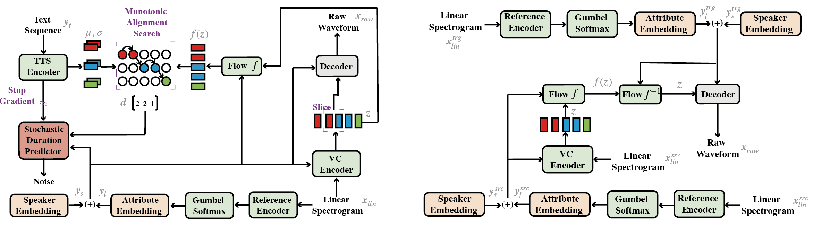

# Emotional Voice Conversion with Semi-Supervised Generative Modeling
Emotional Voice Conversion (EVC) is a task that aims to trans-
form the emotional state of speech from one to another while
preserving linguistic information and speaker identity. How-
ever, many studies are limited by the requirement for parallel
speech data between different emotional patterns, which is not
widely available in real-life applications. Moreover, the pro-
cess of annotating emotional data is highly time-consuming and
labor-intensive. This paper proposes a novel semi-supervised
generative model called SGEVC for emotional voice conver-
sion. Our proposed method utilizes variation autoencoder
(VAE) frameworks to disentangle linguistic, speaker identity,
and emotion spaces. Additionally, we integrate Text-to-Speech
(TTS) into the EVC framework to guide the linguistic content
and design the SGEVC framework in an end-to-end manner.
This paper demonstrates that using as little as 1% supervised
data is sufficient to achieve emotional voice conversion. Our
experimental results show that our proposed model achieves the
state-of-the-art (SOTA) performance.

Visit our [demo](https://haizhu1.github.io/sgevc/) for audio samples.

We also provide the [SGEVC-1 model](https://drive.google.com/file/d/1uzO39mKxiZiirobls1u1ogba65fA6n22/view?usp=sharing).

<table style="width:100%">
  <tr>
    <th>Diagram of the proposed approach, showing the trainng procedure (left) and inference procedure(right).</th>
  </tr>
  <tr>
    <td></td>
  </tr>
</table>

## Pre-requisites
0. Python >= 3.6
0. Clone this repository
0. Install python requirements. Please refer [requirements.txt](requirements.txt)
    1. You need to install sox first: `apt-get install sox`
0. Download pretrained SGEVC-1 model[SGEVC-1 model](https://drive.google.com/file/d/1uzO39mKxiZiirobls1u1ogba65fA6n22/view?usp=sharing)
0. Download datasets [ESD dataset](https://github.com/HLTSingapore/Emotional-Speech-Data)

## Inference
python inference_VC.py

## Training 
python train.py  -c configs/ESD_base.json -m ESD_chinese_semi_3_gamma_1.0_alpha_0.1

## Repository

- [The Implementation of StarGAN-EVC](https://github.com/glam-imperial/EmotionalConversionStarGAN)
- [The Implementation of PPG-VC](https://github.com/liusongxiang/ppg-vc)
- [The Implementation of VITS](https://github.com/jaywalnut310/vits)
